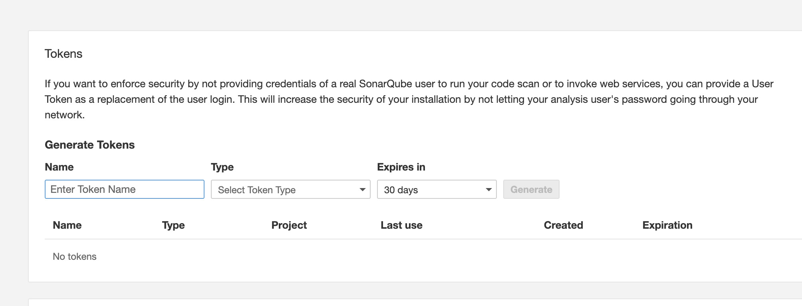
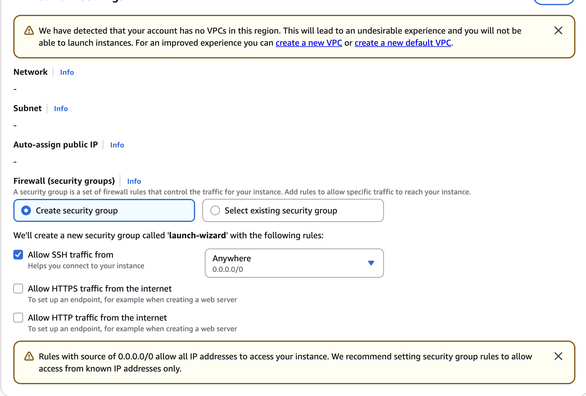

# Question 3 - CI/CD for Microservices

This question uses GitHub Actions as a CI/CD service equivalent to Jenkins to automate build, test, security scan, code quality scan and deployment for a microservices application.

## Project Folder

- `microservices-cicd`: microservices source code, Dockerfiles, Kubernetes/Helm manifests and GitHub Actions workflows.

## Main Components

- `.github/workflows/lab2-question3-test.yml`: test, lint, Docker build validation and Helm lint.
- `.github/workflows/lab2-question3-build-and-deploy.yml`: build Docker images, push to Amazon ECR and deploy to EKS with Helm.
- `.github/workflows/lab2-question3-security-scan.yml`: security scanning with Trivy and dependency check.
- `.github/workflows/lab2-question3-sonarqube.yml`: SonarQube code quality scan and quality gate.
- `microservices-cicd/sonar-project.properties`: SonarQube project configuration.
- `microservices-cicd/nt548-chart`: Kubernetes/Helm manifests for microservices deployment.

## Required GitHub Actions Secrets

- `AWS_ROLE_TO_ASSUME`
- `DB_PASSWORD_BACKEND_USER`
- `SONAR_HOST_URL`
- `SONAR_TOKEN`

## Report Evidence

Capture screenshots of:

- GitHub Actions `Run Tests`
- GitHub Actions `Security Scan`
- GitHub Actions `SonarQube Code Quality`
- GitHub Actions `Build & Deploy to EKS`
- SonarQube dashboard and quality gate result
- ECR repositories/images
- EKS pods, services and ingress
